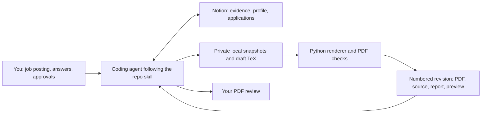

# How Resume Studio works

Resume Studio is a workflow you run with a coding agent in this repository.
You provide a job posting, the agent reads your approved career evidence in
Notion, and a local Python renderer produces a numbered PDF revision for review.
The website's existing Notion integration continues to serve its blog and quotes;
Resume Studio uses the agent's authorized Notion tools separately.

This guide explains the design for reviewers. The authoritative agent workflow is
[SKILL.md](../.agents/skills/resume-studio/SKILL.md).



## What lives where

| Location | Responsibility | Maintained by |
| --- | --- | --- |
| `.agents/skills/resume-studio/` | Workflow instructions, classic template, renderer, verification, and references | Git review |
| Notion **Career Evidence** | Reusable career facts with sources, scope, qualifications, and approval history | Agent with your factual approval |
| Notion **Profile** | Stable contact details, education, skills, and presentation preferences | Agent with your factual approval |
| Notion **Applications** | One record per application attempt, job snapshot, notes, revisions, and next action | Agent during application work |
| Notion **Archive** | Original sources, approvals, and superseded workflow material | Preserved history |
| `.resume-studio/notion.md` | Private hub links, database/view IDs, and application identity mapping | Local configuration |
| `.resume-studio/applications/` | Frozen inputs, working drafts, PDFs, previews, and quality reports | Local working and recovery copies |

The `.claude/skills/resume-studio` symlink points to the same repo skill.
`CONTEXT.md` is a compatibility pointer to it. Neither contains a separate copy
of the workflow.

## One application, from request to review

1. **Start in this repository.** Ask: “Use Resume Studio to tailor my resume for
   this job: [URL or description].” On a fresh checkout the private registry is
   absent, so provide your existing Notion hub and authorized access. The agent
   resolves the existing records before creating local working files.
2. **Read and freeze the sources.** The agent reads the complete Approved evidence
   set and Profile, captures the job posting, and records page identities,
   timestamps, and hashes. A resumed application is identified by its Notion page
   ID. Each revision retains the exact sources it used, even if Notion changes later.
3. **Compare the job with the evidence.** A Match/Gap Report distinguishes supported,
   partial, and unsupported requirements. The agent asks focused questions when
   an answer could change a material claim. Newly discovered facts remain candidates
   until the evidence change is approved.
4. **Write and check the wording.** The agent tailors the application-specific
   content, preserves the stable sections, and checks each claim against its
   sources. It starts from the existing classic LaTeX template.
5. **Render a new revision.** The agent supplies the draft, job snapshot, and evidence
   export to `render.py`. The renderer creates the next unused numbered directory.
   A failed attempt is preserved; a fix receives another revision number.
6. **Review the actual output.** The agent reads the extracted text and visually
   inspects the rendered preview. Passing automated checks produces a reviewable
   draft. You then review the PDF and request edits or explicitly approve that
   exact revision.
7. **Save the record.** The agent attaches the PDF, source, snapshots, source
   manifest, quality report, and visual review under the Notion application. It
   verifies attachment presence and records any verification limits. When you
   approve a PDF, it records the approval and exact artifact identity separately.

## Three separate decisions

| Decision | What it means | What it does not establish |
| --- | --- | --- |
| Evidence becomes **Approved** | You approved the exact factual before/after change for reuse | An uncertain subclaim becomes certain; a PDF is approved |
| Resume becomes **Checked** | Rendering and agent review are complete | You approved the PDF |
| Resume becomes **Approved** | You explicitly approved the identified PDF revision | An application was submitted |

Application stage tracks Preparing, Applied, Interviewing, Offer, Closed, or
Unknown independently of resume state. Candidate evidence may support a specific
application only when you explicitly authorize that exception; it remains a
candidate for reusable evidence. Source qualifications and attribution still apply
to imported Approved records.

## What the code checks, and what the agent does

`render.py` is a local compiler and layout checker. It runs two pdfLaTeX passes,
checks for one page, extracts text, checks missing glyphs and overflow, checks word
boundaries, and produces PNG previews plus a JSON report with input/PDF hashes.
It refuses an existing output directory, marks outer artifacts read-only, and
removes compile products only when an identical outer copy exists.

Factual accuracy, gap analysis, evidence approval, writing, visual review, and
Notion updates are agent responsibilities described in the skill. The Python
checks cannot determine whether a career claim is true. The skill is an instruction
contract, not a program that technically enforces every approval step.

Notion reads and writes happen through the agent during a task. There is no
background sync process, local application server, separate local database, or
Notion API client added for Resume Studio in this PR. Local evidence exports are
dated snapshots; future tasks must read current Notion records.

The renderer requires macOS, Python 3.9+, TeX, Poppler, and `sandbox-exec`. It uses
the Python standard library. Its compiler restrictions disable shell escape,
restrict reads and writes, block networking, and limit runtime and file size.
Other operating systems require a separately tested compiler sandbox.
See [rendering details](../.agents/skills/resume-studio/references/rendering.md).

## Review and verify this change

Read the files in this order:

1. [SKILL.md](../.agents/skills/resume-studio/SKILL.md): the complete agent workflow.
2. [Notion contract](../.agents/skills/resume-studio/references/notion.md): record
   structure, reading, saving, and approvals.
3. [render.py](../.agents/skills/resume-studio/scripts/render.py): executable
   layout checks and revision preservation.
4. [verify-render.py](../.agents/skills/resume-studio/scripts/verify-render.py):
   regression checks using fictional data in a temporary workspace.
5. [Evidence refresh](../.agents/skills/resume-studio/references/evidence-refresh.md):
   how new observations become proposed evidence changes.
6. [.gitignore](../.gitignore) and [.vercelignore](../.vercelignore): exclusions
   for private files and deployment uploads.

On a Mac with the renderer prerequisites, run from the repository root:

```sh
python3 .agents/skills/resume-studio/scripts/verify-render.py
python3 .agents/skills/resume-studio/scripts/render.py --help
```

The verifier exercises 14 checks and removes its temporary artifacts by default.
Use `--keep-artifacts` when you want to inspect its fictional PDF; it retains the
workspace under `.resume-studio/tests/`, outside real applications. The existing
website CI runs separately on Linux and does not run the macOS renderer suite.

## What merging or reverting does

Merging versions the reusable workflow, renderer, template, documentation, and
exclusions. It does not install the local toolchain, provision Notion databases,
grant Notion access, migrate private records, or approve or submit a resume.

The accompanying private cleanup was performed separately: Notion records were
reorganized, old application implementations and historical files were archived,
and rebuildable caches were removed. Those files were outside this repository or
already untracked/ignored, so their removal does not appear as Git deletions.
Private migration manifests and recovery copies document those operations.
Reverting this PR reverses the tracked code/configuration changes; restoring
Notion or local archives is a separate recovery action.

This repository is public. Career evidence, private Notion IDs, application
artifacts, and migration logs stay outside the PR. The ignore rules do not remove
already tracked files or erase history; existing tracked public resume files are
unchanged. The website has no Resume Studio data integration in this change.

Uploaded attachment presence and uploaded-byte verification are distinct checks.
If the connector/browser cannot download the saved bytes, the agent must record
that limit and preserve local originals until a byte-level comparison is possible.
