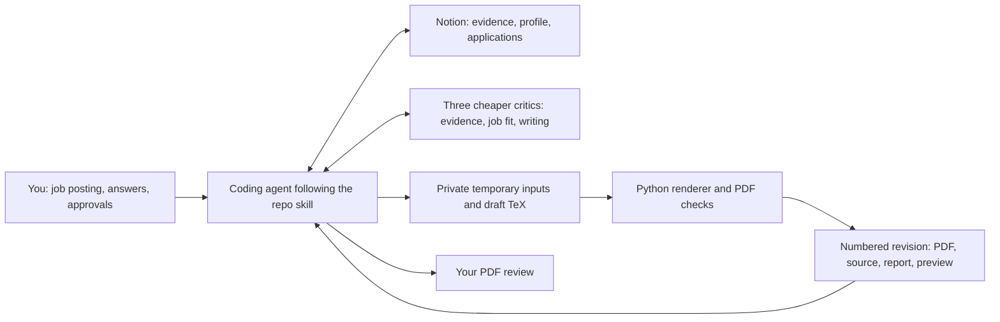

# How Resume Studio works

Resume Studio is a workflow you run with a coding agent in this repository.
You provide a job posting, the agent reads your approved career evidence in
Notion, and a local Python renderer produces a numbered PDF revision for review.
The website's existing Notion integration continues to serve its blog and quotes;
Resume Studio uses the agent's authorized Notion tools separately.

This guide explains the design for reviewers. The authoritative agent workflow is
[SKILL.md](../.agents/skills/resume-studio/SKILL.md).



## What lives where

| Location | Responsibility | Maintained by |
| --- | --- | --- |
| `.agents/skills/resume-studio/` | Workflow instructions, classic template, renderer, verification, and references | Git review |
| Adversarial subagents | Independent objections and rechecks of the main agent's revisions | Main agent coordinates lower-capability models |
| Notion **Career Evidence** | Reusable career facts with sources, scope, qualifications, and approval history | Agent with your factual approval |
| Notion **Profile** | Stable contact details, education, skills, and presentation preferences | Agent with your factual approval |
| Notion **Applications** | One record per application attempt, job snapshot, notes, revisions, and next action | Agent during application work |
| Notion **Archive** | Original sources, approvals, and superseded workflow material | Preserved history |
| System temporary directory | Inputs, working drafts, PDFs, previews, and compiler diagnostics while a revision is built and saved | Removed after Notion artifacts pass byte-level verification |

The old ignored `.resume-studio/` directory remains recovery material until its
contents are checked against Notion; new work uses temporary storage.

The `.claude/skills/resume-studio` symlink points to the same repo skill.
`CONTEXT.md` is a compatibility pointer to it. Neither contains a separate copy
of the workflow.

## One application, from request to review

1. **Start with Notion access.** Ask: “Use Resume Studio to tailor my resume for
   this job: [URL or description].” The agent finds the existing Resume Studio hub
   in Notion, verifies its records, and asks for the hub URL if its identity is
   unclear. A fresh checkout or cloud agent needs no local registry. Rendering
   still requires a Mac with the toolchain described below.
2. **Read and freeze the sources.** The agent reads the complete Approved evidence
   set and Profile, captures the job posting in the owning Notion Application,
   and records page identities, timestamps, and hashes. A resumed application is
   identified by its Notion page ID. Each Notion revision retains the exact sources
   it used, even if the bank changes later.
3. **Interview for useful gaps and opportunities.** A Match/Gap Report distinguishes
   supported, partial, and unsupported requirements in the available evidence.
   The agent asks questions that could improve claims, example selection,
   positioning, or your intended emphasis, including work missing from the bank.
   It prioritizes questions with a
   concrete payoff, asks one focused topic at a time, and reuses prior answers.
   New reusable facts remain candidates until you approve the exact evidence change.
4. **Write and check the wording.** The agent tailors the application-specific
   content, preserves the stable sections, and checks each claim against its
   sources. It starts from the existing classic LaTeX template.
5. **Challenge the draft.** Three independent critics review evidence, job fit, and
   writing. The main agent uses a lower-capability model for these roles, preferring
   Luna in Codex when it is below the main model's tier. It addresses each finding
   with evidence, a rewrite, or a question for you, then sends the revised draft
   back to the critics for a recheck. See the
   [review protocol](../.agents/skills/resume-studio/references/adversarial-review.md)
   for the model fallback and stopping rules.
6. **Render a new revision.** The agent supplies temporary copies of the draft, job
   snapshot, and evidence export to `render.py`. The renderer creates the next
   unused numbered directory in a private system temporary workspace. A failed
   attempt is recorded in Notion; a fix receives another revision number.
7. **Review the actual output.** The agent reads the extracted text and visually
   inspects the rendered preview. Wording changes made during layout repair return
   to the writing and critic passes. A completed review identifies the exact final
   version; an earlier pass does not approve a later rewrite. You then review the
   PDF and request edits or explicitly approve that exact revision.
8. **Save the record.** The agent writes reviews and decisions into the Notion
   revision and attaches its exact PDF, source, snapshots, manifest, and quality
   report. It downloads the saved files, verifies their hashes, then removes the
   temporary workspace. An incomplete upload remains visibly Draft/incomplete
   in Notion. When you approve a PDF, the agent records the approval and exact
   artifact identity separately.

## Three separate decisions

| Decision | What it means | What it does not establish |
| --- | --- | --- |
| Evidence becomes **Approved** | You approved the exact factual before/after change for reuse | An uncertain subclaim becomes certain; a PDF is approved |
| Resume becomes **Checked** | Rendering and visual inspection pass; adversarial review completes or you explicitly waive it | You approved the PDF |
| Resume becomes **Approved** | You explicitly approved the identified PDF revision | An application was submitted |

Application stage tracks Preparing, Applied, Interviewing, Offer, Closed, or
Unknown independently of resume state. Candidate evidence may support a specific
application only when you explicitly authorize that exception; it remains a
candidate for reusable evidence. Source qualifications and attribution still apply
to imported Approved records.

## Useful questions and real disagreement

Missing evidence is a reason to ask, rather than proof that you lack experience.
For example: “The job emphasizes reliability, and the bank describes your API work
without an operational result. Did you handle incidents or improve reliability
there? That could give us a stronger example.” Questions can also uncover a better
project or clarify which work you want to emphasize, even when the bank already
covers the posting. You can skip a question; the agent records the gap and uses a
supported alternative or omits the unsupported claim.

Critics begin independently, then exchange specific findings and responses with
the main agent. The default limit is an initial critique plus two rechecks, using
the same critics and targeted updates, with at most nine critic turns including
retries. A completed review requires
every critic to review the same final content and confirm resolution of material
objections. Optional editorial disagreements can remain documented. Majority vote
does not establish a fact, and critic agreement does not approve a PDF for you.
Unresolved material objections or unavailable independent reviewers leave a
provisional Draft with the limitation and next steps recorded. You may explicitly
waive the independent review step; the other checks still apply, and the record
will say the independent review was waived rather than completed.

## What the code checks, and what the agent does

`render.py` is a local compiler and layout checker. It runs two pdfLaTeX passes,
checks for one page, extracts text, checks missing glyphs and overflow, checks word
boundaries, and produces PNG previews plus a JSON report with input/PDF hashes.
It refuses an existing output directory, marks outer artifacts read-only, and
removes compile products only when an identical outer copy exists.

Factual accuracy, questioning, writing, critic coordination, visual review, and
Notion updates are agent responsibilities described in the skill. The Python
checks cannot determine whether a career claim is true. The skill is an instruction
contract, not a program that technically enforces every approval step.

Notion reads and writes happen through the agent during a task. There is no
background sync process, local application server, or separate local database.
Temporary evidence exports are dated inputs; future tasks read current Notion
records and the frozen snapshots attached to earlier revisions.

The renderer requires macOS, Python 3.9+, TeX, Poppler, and `sandbox-exec`. It uses
the Python standard library. Its compiler restrictions disable shell escape,
restrict reads and writes, block networking, and limit runtime and file size.
Other operating systems require a separately tested compiler sandbox.
See [rendering details](../.agents/skills/resume-studio/references/rendering.md).

## Review and verify this change

Read the files in this order:

1. [SKILL.md](../.agents/skills/resume-studio/SKILL.md): the complete agent workflow.
2. [Notion contract](../.agents/skills/resume-studio/references/notion.md): record
   structure, reading, saving, and approvals.
3. [Adversarial review](../.agents/skills/resume-studio/references/adversarial-review.md):
   critic assignments, responses, rechecks, and completion criteria.
4. [render.py](../.agents/skills/resume-studio/scripts/render.py): executable
   layout checks and revision preservation.
5. [verify-render.py](../.agents/skills/resume-studio/scripts/verify-render.py):
   regression checks using fictional data in a temporary workspace.
6. [Evidence refresh](../.agents/skills/resume-studio/references/evidence-refresh.md):
   how new observations become proposed evidence changes.
7. [.gitignore](../.gitignore) and the Worker build-output check: exclusions
   for private files and deployment uploads.

On a Mac with the renderer prerequisites, run from the repository root:

```sh
python3 .agents/skills/resume-studio/scripts/verify-render.py
python3 .agents/skills/resume-studio/scripts/render.py --help
```

The verifier exercises 15 checks and removes its temporary artifacts by default.
Use `--keep-artifacts` when you want to inspect its fictional PDF; it retains the
workspace in the system temporary directory, outside real applications. The existing
website CI runs separately on Linux and does not run the macOS renderer suite.

## What merging or reverting does

Merging versions the reusable workflow, renderer, template, documentation, and
exclusions. It does not install the local toolchain, provision Notion databases,
grant Notion access, migrate private records, or approve or submit a resume.

The earlier private cleanup was performed separately: Notion records were
reorganized, old application implementations and historical files were archived,
and rebuildable caches were removed. Existing private archives remain untouched
by this workflow change. Reverting the tracked code does not restore or remove
Notion records or private archives.

This repository is public. Career evidence, private Notion IDs, application
artifacts, and migration logs stay outside the PR. The ignore rules do not remove
already tracked files or erase history; existing tracked public resume files are
unchanged. The website has no Resume Studio data integration in this change.

Uploaded attachment presence and uploaded-byte verification are distinct checks.
If the saved bytes cannot be downloaded, the agent records the gap in Notion and
keeps the current temporary files while retrying. It does not mark the revision
durable or use temporary files as the shared application record.
